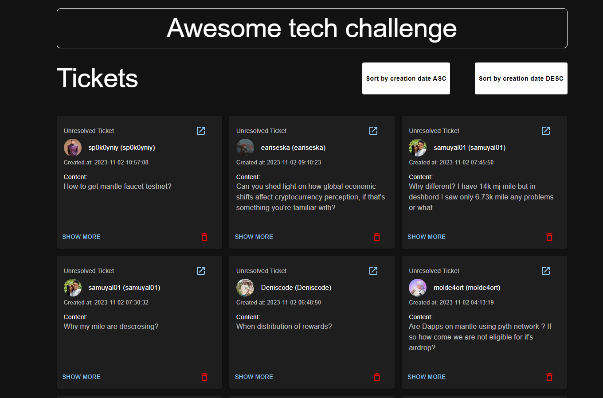

# Awesome ticket challenge

## Proposed Solution:
Interfaces Developed:

### /home Interface:
This interface hosts three buttons designed in alignment with the Figma design provided. Among the buttons, the functional one is the "Tickets" button, redirecting users to the /tickets interface.

### /tickets Interface:
**Display:** Presents a grid layout showcasing ticket cards with a pagination for seamless navigation.
**Card Components:** Each card contains:
- Author Avatar.
- Author Name: author name (author nickname).
- Creation Date.
- Content of the message.
- Three Action Buttons:
    - Discord Redirect: A button facilitating redirection to Discord (using msg_url).
    - "Show More": Triggers a popup, providing in-depth details about the specific ticket.
    - Delete Button: Enables the removal of a ticket from the grid list.
- Sorting Feature: Users can sort tickets by creation date in either ascending or descending order.

**"Show More" Popup Details:**
The expanded popup aims to offer more details about the ticket relevant to moderators, including:
- Author Name: author name (author nickname).
- Content of the message.
- Attachment Status: Indicates whether an attachment is present (Yes/No).
- Ticket Status
- Context Messages: This section contains a list of context messages associated with the ticket. Each message includes the author's name (nickname) with specifying if its a bot or not (by adding "- bot" if its a bot), avatar, and creation date. Moreover, each context message incorporates a carousel to allow users to view the context message's content.

**Deletion Process:**
Confirmation Popup: When initiating a deletion, a confirmation popup appears to ensure user confirmation before permanently removing the ticket.

## Some Screenshots:

## How to run:
### Backend

Steps to setup the backend environment:

1. Run `make setup`
2. Run `make run`
3. Try it by calling [http://localhost:5001/tickets](http://localhost:5001/tickets)

### Frontend

1. Run `make setup`
2. Run `make run`
3. Open it: [http://localhost:3002](http://localhost:3002)

Note: I have implemented unit testing for the apis. You can run it by running this command inside backend folder `pytest`
### Happy Reviewing 🎉
